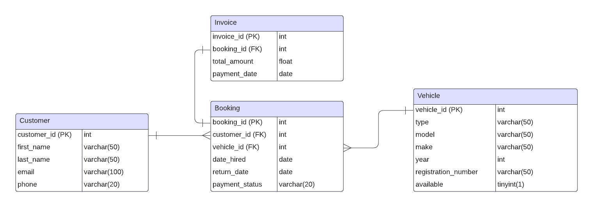

**Car Hire Management System.**

## Details
The main focus of the business is renting cars and vans, and the database is to manage the booking system.
## Requirements:

* Vehicles are categorized into small cars (suitable for carrying up to 4 people), family cars (suitable for carrying up to 7 adults), and vans.

* Information stored for each booking includes customer, car, date of hire and date on which the vehicle is to be returned.

* A customer cannot hire a car for longer than a week.

* If a vehicle is available, the customer's details are recorded (if not stored already) and a new booking is made.

* Potential or existing customers can book a vehicle up to 7 days in advance depending on availability. 

* Customers must pay for the vehicle at the time of hire.

* On receiving an enquiry, employees are required to check availability of cars and vans. 

* An invoice is written at the time of booking for the customer. 

* If the booking has been made in advance, a confirmation letter will be sent to the customer.

* A report is printed at the start of each day showing the bookings for that particular day. 

## Deliverables:

* An ERD diagram describes the DB design, field types, relationships, constraints, etc. ( a screenshot on your repo is fine)

* SQL which implements above ERD. (MySQL)
  * [MySQL ERD Implementation](./database/db.py)

* A Python microservice implemented using Flask microframework that should connect to MySQL DB and have the following endpoints:
  * [Endpoint Implementation](./app.py)
  
## Notes:
* I added the [SQL](./database/create_database.sql) script to create the database and the [Environment Variables](./envs.env) to the repo in case you wanted to run the code. I am aware these would be left out of version control for security purposes under normal circumstances.

* I added this [Postman collection](./test/car_hire_management_endpoint_tests.postman_collection.json) to test the Customer endpoints.

## TODO (Out of Scope):
* Create endpoints for the Invoice, Booking and Vehicle entities.
* Create manager (controller) classes for Invoice, Booking and Vehicle.
* Create separate routing files for entity endpoints once above is completed.
* Create the front end implementation (views).
* Create Unit Tests

